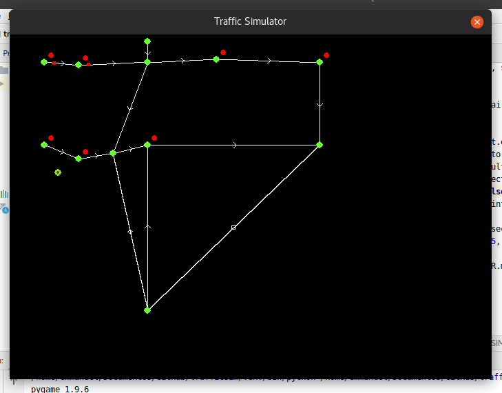
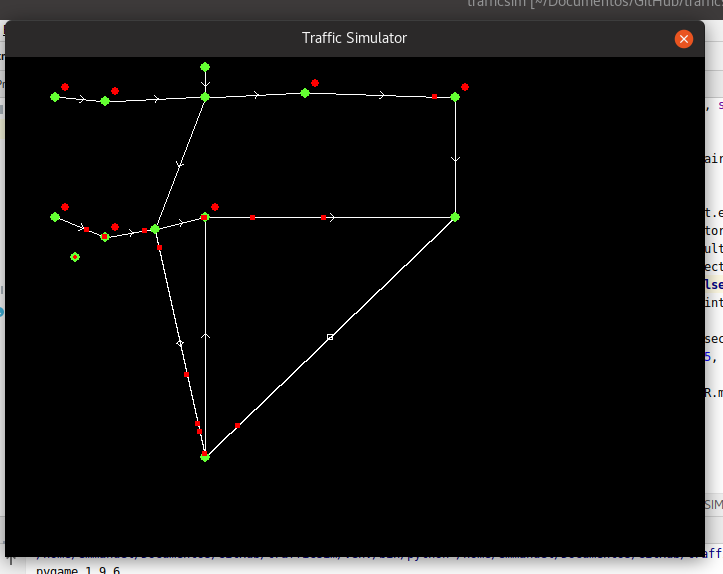
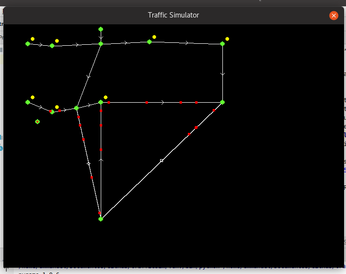
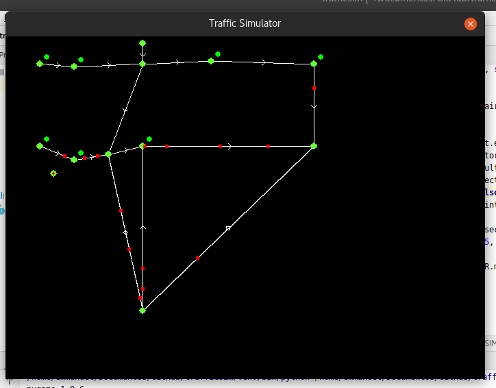

# TrafficSim
#### A simple traffic simulator in python

Legend:

* Red squares: cars
* Green dots: intersections
* White lines: streets (the arrow indicates directions, the diamond is both directions)
* Green dots with red dot inside: car spawn
* Dots near intersections: traffic lights, they can be red, yellow or green

